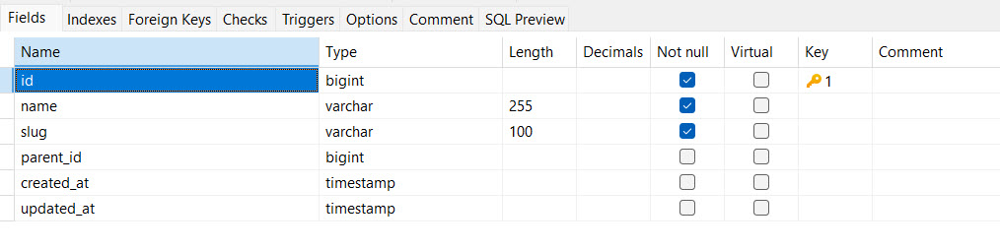
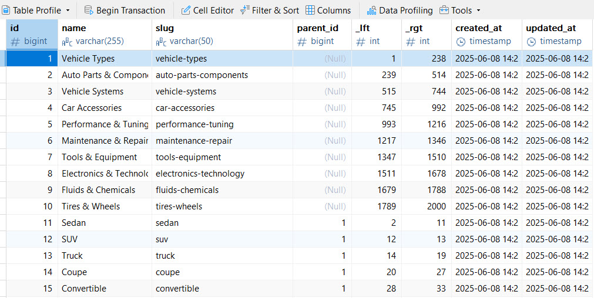
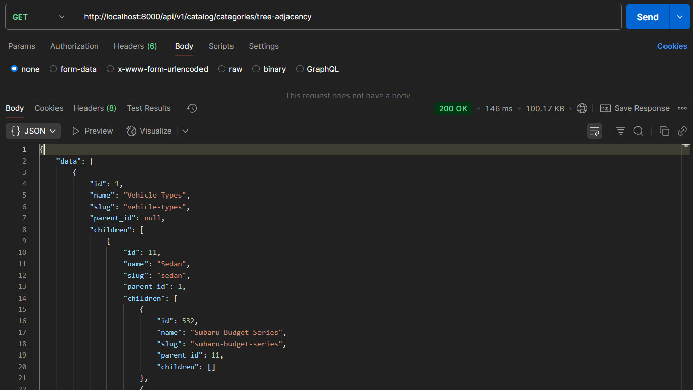
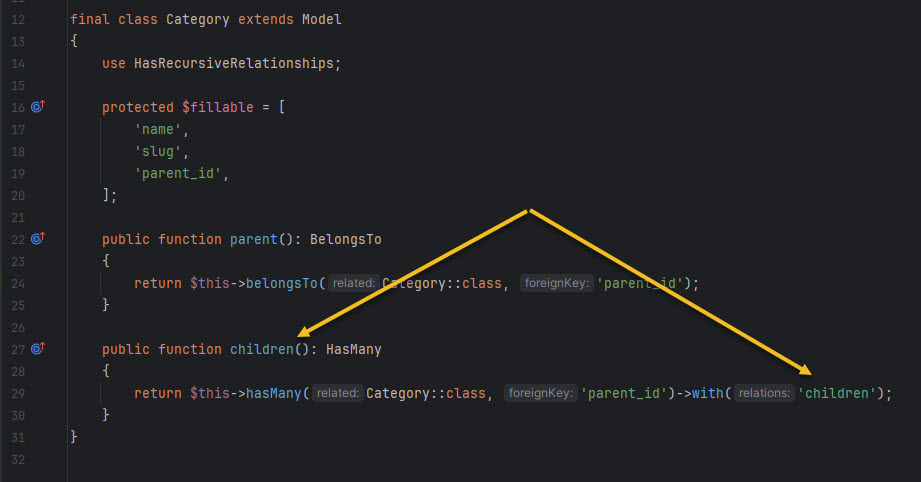
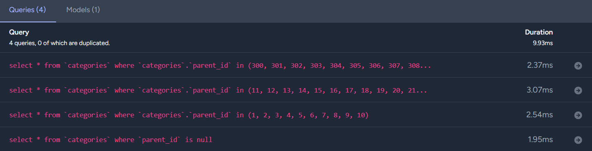
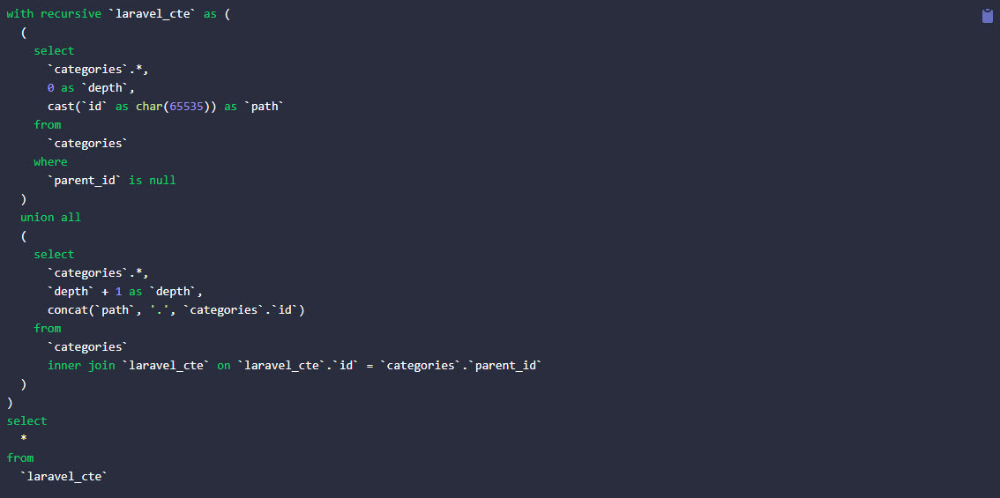
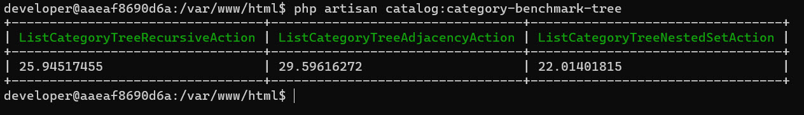
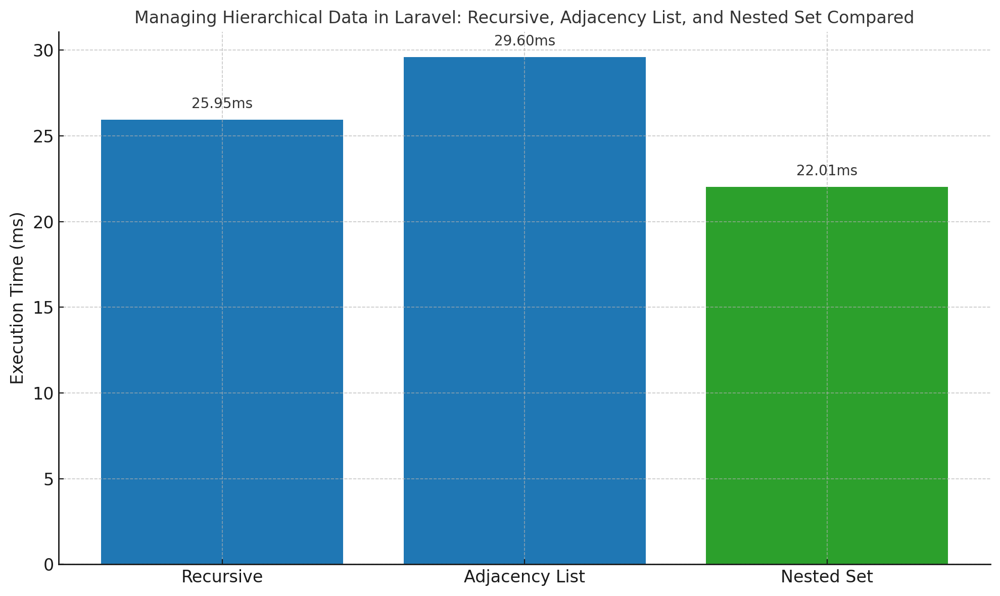

# Managing Hierarchical Data in Laravel: Recursive, Adjacency List, and Nested Set Compared

Let's face it: hierarchical data - think categories, menus, or threaded comments - shows up all over Laravel projects.
Whether you're dealing with an e-commerce catalog, a file directory tree, or the usual corporate who-reports-to-whom mess,
you need a solid way to handle all those parent-child relationships.

We're diving into **three different strategies** for managing those category trees in Laravel 12:

1. Laravel builtin **recursive relationship**
2. The **adjacency list + CTE** approach using [`staudenmeir/laravel-adjacency-list`](https://github.com/staudenmeir/laravel-adjacency-list)
3. Classic **nested set model** using [`kalnoy/nestedset`](https://github.com/lazychaser/laravel-nestedset)

We have a 1000-node category tree for an automotive parts catalog.
We'll walk you through each method, show off how they perform, and spill which ones work best in which situations.

## Setting Up the Recursive Structure: Categories Table

All those three approaches will use the same(almost) base table structure:



This classic structure is ideal for building recursive relationships and works well with both packages.

The table's packed with legit, realistic categories, kinda like this:

```
Auto Parts & Components
└── Engine Parts
    └── Engine Bearings
Performance & Tuning
└── Performance Engine Parts
    └── Performance Valve Springs
Tools & Equipment
└── Hand Tools
    ├── Sockets
    └── Tap and Die Sets
Vehicle Systems
├── Exhaust Management System
│   └── Fleet Series for Bentley RV
└── Lighting System
    └── Acura Economy Series
Vehicle Types
└── Truck
    └── Mercedes-Benz RV Japanese Options
Electronics & Technology
└── Gauges & Monitors
    └── Volvo Minivan American Options
Tires & Wheels
└── SUV Tires
    └── Nissan Sedan Professional Options
Maintenance & Repair
└── Undercoating
    └── Chrysler Mid-Range Essentials
```

Here's how it actually looks in the database:


We exposed the following endpoints in the API:

```php
Route::prefix('catalog/categories')->group(function () {
    Route::get('tree-recursive', [CategoryController::class, 'treeRecursive']);
    Route::get('tree-adjacency', [CategoryController::class, 'treeAdjacency']);
    Route::get('tree-nested-set', [CategoryController::class, 'treeNestedSet']);
});
```



## Approach 1: Recursive Relationship

Laravel has built-in support for recursive relationships with Eloquent. 
You can set up a `children()` relationship that calls itself:

```php
final class Category extends Model
{
    public function children(): HasMany
    {
        return $this->hasMany(Category::class, 'parent_id')->with('children');
    }
}
```



Fetching the Tree:

```php
final class ListCategoryTreeRecursiveAction implements Actionable
{
    public function handle(): Collection
    {
        return Category::query()
            ->whereNull('parent_id')
            ->with('children')
            ->get();
    }
}
```

This approach fires off several SQL queries basically, one for every tree level:

```
select * from categories where parent_id is null;
select * from categories where parent_id in (...);
select * from categories where parent_id in (...);
...
```



**Pros:**

* Native to Laravel, no packages needed.
* Works well for trees that aren't super deep.

**Cons:**

* N+1 query problem: every extra level means more queries.
* Performance drops fast as the tree gets deeper.

## Approach 2: Adjacency List (CTE)

[staudenmeir/laravel-adjacency-list](https://github.com/staudenmeir/laravel-adjacency-list) helps to reduce recursive queries using Common Table Expressions (CTEs).

Install the package:
`composer require staudenmeir/laravel-adjacency-list`

Add trait to your model:

```php
use Staudenmeir\LaravelAdjacencyList\Eloquent\HasRecursiveRelationships;

final class Category extends Model
{
    use HasRecursiveRelationships;
}
```

Fetching the Tree:

```php
final class ListCategoryTreeAdjacencyAction implements Actionable
{
    public function handle(): Collection
    {
        return Category::tree()->get()->toTree();
    }
}
```

Under the hood, it's doing this recursive SQL CTE magic for you:

```sql
with recursive `laravel_cte` as (select *
   from categories
   where parent_id is null
   union all
   select categories.*
   from categories inner join laravel_cte on laravel_cte.id = categories.parent_id)
select * from laravel_cte;
```

This approach offloads the recursion to the **database engine**, reducing number of queries to one.



**Pros:**

* Efficient: single-query fetch for the whole tree.
* Built-in tracking for depth and paths.
* More maintainable than raw recursion.
* Other handy methods for working with recursive relationships.

**Cons:**

* Requires package.
* Slight overhead over native recursion (but more scalable).

## Approach 3: Nested Set Model

The Nested Set Model is a bit different from the classic parent-child setup. 
Instead, it jams your hierarchy into flat `_lft` and `_rgt` columns, 
letting you grab the whole tree with a single, superfast query. No recursion headaches.


The [nested set model](https://en.wikipedia.org/wiki/Nested_set_model) precomputes hierarchy into `_lft` and `_rgt`
columns for **blazing-fast reads**, at the cost of more complex writes.

Installation:
```bash
composer require kalnoy/nestedset
```

Add those columns in migration:

```php
Schema::table('categories', function (Blueprint $table) {
    $table->unsignedInteger('_lft')->default(0)->after('parent_id');
    $table->unsignedInteger('_rgt')->default(0)->after('_lft');
});
```

Use a separate model to avoid conflicts with previous package:

```php
use Kalnoy\Nestedset\NodeTrait;

final class CategoryNode extends Model
{
    use NodeTrait;

    protected $table = 'categories';
}
```

### Tree initialization
If you're doing bulk inserts or things get out of sync, run this to fix your boundaries:

```php
(new CategoryNode())->newNestedSetQuery()->fixTree();
```

`fixTree()` recalculates the `_lft` and `_rgt` values.

Fetching the Tree:

```php
final class ListCategoryTreeNestedSetAction implements Actionable
{
    public function handle(): Collection
    {
        /** @var Collection $categories */
        $categories = CategoryNode::query()->get();

        return $categories->toTree();
    }
}
```

SQL:

```sql
select * from categories;
```

Just **single query**, with all hierarchical logic resolved via `_lft`/`_rgt`.

**Pros:**

* Best performance for read-heavy cases.
* Single flat query, minimal joins.

**Cons:**

* Writes (inserts/moves) are more complex and can get messy.
* Requires careful tree rebuilding after big imports or structural changes.

## Benchmark Results

Each approach underwent benchmarking through 100 repeated executions using the 1,000-category tree for testing:

```php
$measures = Benchmark::measure([
	class_basename(ListCategoryTreeRecursiveAction::class) => fn() => $listCategoryTreeRecursiveAction->handle(),
	class_basename(ListCategoryTreeAdjacencyAction::class) => fn() => $listCategoryTreeAdjacencyAction->handle(),
	class_basename(ListCategoryTreeNestedSetAction::class) => fn() => $listCategoryTreeNestedSetAction->handle(),
], 100);

$this->table(array_keys($measures), [$measures]);
```

### Result

Environment: Laravel 12, PHP 8.2, MySQL 8.0 on Intel i7 with 16GB RAM(not exactly supercomputer, but it gets the job done)

| Recursive   | Adjacency List | Nested Set      |
|-------------|----------------|-----------------|
| 25.945174ms | 29.596162ms    | **22.014018ms** |

All results reflect average performances from 100 executions but actual performance will depend on hardware specifications together with database size and SQL optimization.





> The nested set model was the fastest due to minimal computation at runtime. The recursive approach was not far behind,
> while the adjacency list (despite using CTE) had a slight overhead.

## So, When Should You Use What?

| Approach        | Pros                                        | Cons                                       | Go For It When...                                   |
|-----------------|---------------------------------------------|--------------------------------------------|-----------------------------------------------------|
| Recursive       | Super simple in Laravel, no headaches       | Multiple queries, kinda slow for big trees | Your tree is tiny and you just want it to work      |
| Adjacency (CTE) | One query, recursion baked right in SQL     | Needs a package, slower in PHP processing  | You want SQL-powered trees with decent depth        |
| Nested Set      | Blazing fast reads, perfect for giant trees | Tricky to maintain, complex updates        | Your data is read-heavy and don't change it up much |

If you're dealing with a **small, pile of categories**, just use Laravel's built-in recursion.

When you **need scalability**, especially for **deep hierarchies**, consider the **Adjacency List**. It offers a balance
between simplicity and performance.

For **maximum read performance**, particularly when rendering large menus or exporting full trees, **Nested Set**
wins-but beware of its complexity when modifying the structure (create, move, delete node).

## Source Code

You can check out everything I talked about (and probably some extra stuff I forgot to mention) right on GitHub:

👉 **[tegos/laravel-hierarchical-data](https://github.com/tegos/laravel-hierarchical-data)**

Inside, you'll find:

* Category data seeder
* Actions for each tree-building approach
* API routes and controller logic
* Benchmarking command

## Summary Table

| Approach   | Setup Hassle | Read Perf. | Write Perf. | Best For               |
|------------|--------------|------------|-------------|------------------------|
| Recursive  | Low          | Medium     | High        | Small trees            |
| Adjacency  | Medium       | Medium     | Medium      | Medium-depth trees     |
| Nested Set | High         | High       | Low         | Read-heavy, deep trees |

## Resources

* [Laravel relationships](https://laravel.com/docs/master/eloquent-relationships)
* [Recursive hasMany Relationship](https://laraveldaily.com/post/eloquent-recursive-hasmany-relationship-with-unlimited-subcategories)
* [Recursive Nested Data](https://codecourse.com/articles/recursive-nested-data-in-laravel)
* [What Is a Recursive CTE in SQL?](https://learnsql.com/blog/sql-recursive-cte)
* [Optimizing Tree Data in SQL: The Nested Set Model](https://medium.com/@leo.dorn/optimizing-tree-data-in-sql-the-nested-set-model-for-tree-structures-72c1aae0f6f9)


## Final Thoughts

Managing hierarchical data structures? Not exactly a walk in the park. 
Laravel gives you plenty of options-whether you're setting up recursive relationships, leveraging SQL CTEs, or tuning for speed with nested sets.

Each strategy has its place:

* **Go recursive** when your tree is small and you want quick setup.
* **Use adjacency lists** for medium trees and clear SQL recursion.
* **Choose nested sets** for massive or performance-critical read scenarios.

There's no universal solution here. Choose the strategy that best fits your data structure, usage patterns, and performance needs.
Laravel gives you the tools, but the choice? That's all you.

